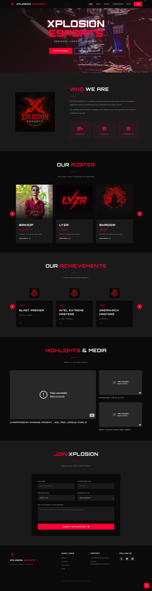

# Xplosion eSports

Welcome to Xplosion eSports, a dynamic and engaging website dedicated to the world of eSports. This platform brings together gamers, fans, and enthusiasts to explore tournaments, player profiles, and the latest in competitive gaming.

## Features

- **Tournament Information**: Stay updated with upcoming and ongoing eSports tournaments.
- **Player Profiles**: Discover top players and their achievements.
- **Interactive UI**: A sleek and responsive design for an immersive experience.

## UI Preview



## Getting Started

To view the website locally:

1. Clone the repository:
   ```
   git clone https://github.com/Ekanshps/Xplosion-eSports.git
   ```

2. Open `index.html` in your web browser.

## Technologies Used

- HTML
- CSS
- JavaScript

## Contributing

Feel free to contribute to the project by submitting issues or pull requests.

## License

This project is licensed under the MIT License.